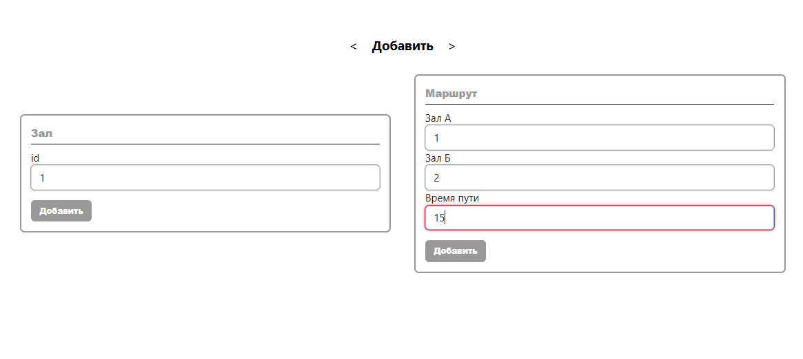
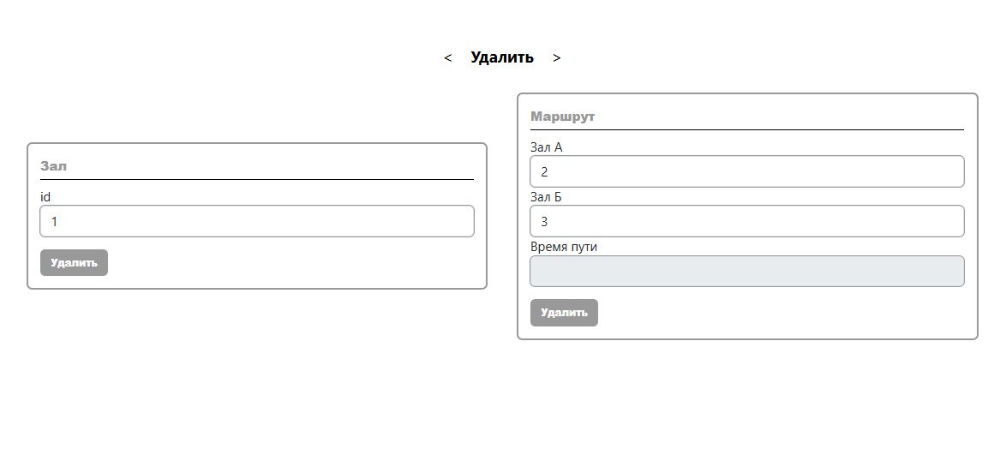
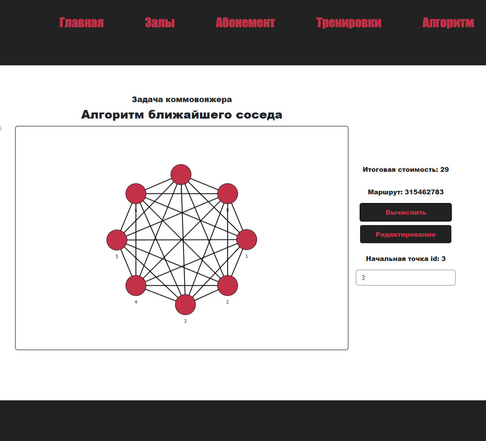

# PulseGym

> Web application for visualizing and solving the Traveling Salesman Problem using the nearest neighbor algorithm.

Developed as part of two interconnected course projects:
- **Discrete Mathematics Algorithms** — implementation and analysis of the nearest neighbor algorithm (O(n²) complexity) for solving the TSP. The algorithm is designed to find a "good enough" approximate route visiting all vertices exactly once and returning to the starting point.
- **Client-Server Application Development** — building a full-stack application using React, Nest.js, PostgreSQL, and Redux, with a focus on HTML, CSS, and modern UI design. The algorithm is integrated into a ;pca; web environment where users can interact with the graph, manage data through CRUD operations, and visualize the computed route.

The application allows building a graph of transitions between gyms, visualizing routes on an interactive graph, calculating the optimal route for visiting all gyms, and managing data (creating, updating and deleting gyms and routes).

A GIF demonstrating the application usage is available at: [docs/demo.gif](docs/demo.gif)

## Table of Contents
- [Background](#background)
- [Features](#features)
- [Install](#install)
- [Usage](#usage)
- [Screenshots](#screenshots)
- [API](#api)
- [Maintainers](#maintainers)

## Background

The Traveling Salesman Problem (TSP) is one of the most famous NP-hard problems in combinatorial optimization. The nearest neighbor algorithm is a heuristic method that provides a "good enough" approximate solution in polynomial time:

$$O(n^2)$$

This project was created to visually demonstrate the operation of this algorithm using a network of gyms as an example. It includes both the software implementation of the algorithm and a client-server application for data interaction.

## Features

- **Graph Visualization** — interactive display of gyms and routes between them.
- **Route Calculation** — implementation of the nearest neighbor algorithm with display of traversal order and total cost.
- **Full CRUD Operations** — create, update and delete gyms (vertices) and hallways (edges).
- **Graph Completeness Check** — automatic verification before running the algorithm.
- **Triangle Inequality Check** — ensures route weights satisfy the triangle inequality criteria, which is required for the algorithm to work correctly.
- **Persistent Storage** — all data is stored in a local PostgreSQL database.
- **Reverse Routes** — when you add a route from A to B, the reverse route from B to A is created automatically.
- **Console Logger** — a pop-up window that appears only when errors occur, displaying error messages.

## Install

To install and run the project, follow these steps.

### Requirements

- [Node.js](https://nodejs.org/) (version 14.x or higher)
- [npm](https://www.npmjs.com/) (comes with Node.js) or [Yarn](https://yarnpkg.com/)
- [PostgreSQL](https://www.postgresql.org/) (version 12 or higher)

### Installation Steps

1. **Clone the repository**
   ```bash
   git clone https://github.com/AlexThatDefinetlyStudiesIT/TSP-NearestGym-Visualiser.git
   cd PulseGym
   ```

2. **Set up the database**
   - Create a `gymDB` database in PostgreSQL.
   - Configure the connection in `PulseGym/src/server/src/app.module.ts`:
     ```typescript
     TypeOrmModule.forRoot({
       type: 'postgres',
       host: 'localhost',
       port: 5432,
       username: 'postgres',
       password: 'your_password',
       database: 'gymDB',
       synchronize: true,  // Set to false in production
     })
     ```

3. **Install server dependencies**
   ```bash
   cd PulseGym/src/server
   npm install
   ```

4. **Install client dependencies**
   ```bash
   cd ../client/pulseapp
   npm install
   # or if you have Yarn installed:
   yarn install
   ```

### Troubleshooting

**If database tables are missing:**
- Set `synchronize: true` in `app.module.ts` and restart the server

## Usage

### Starting the Server

The server runs on port `3001`.

```bash
cd PulseGym/src/server
npm start run:debug
```

### Starting the Client

The client runs on port `3000`.

```bash
cd PulseGym/src/client/pulseapp
npm start
# or
yarn start
```

After starting, the application should open automatically on `http://localhost:3000`. If it does not, navigate to `http://localhost:3000` manually.

> **Note:** The client will run without the server, but the algorithm and CRUD operations will not work since they depend on the backend logic.

### Using the Application

#### Main Page (`/`)
1. Click **"Алгоритм"** in the top-right corner to navigate to the main application page.
2. The page displays:
   - **Graph** — visual representation of gyms and routes.
   - **Console Logger** — a pop-up window that appears only when errors occur, showing detailed error messages.
   - **Control Panel** — for calculating routes and managing data.

#### Algorithm Page (`/inventory`)
1. **Set the starting point** — enter the ID of the gym where the route will begin in the **"Начальная точка id"** field.
2. **Calculate the route** — click the **"Вычислить"** button.
3. **View results** — the route and total cost will be displayed in the **"Итоговая стоимость"** and **"Маршрут"** fields automatically upon successful calculation.
4. **Refresh** — click the refresh page button (⟳) to reset the graph zoom and calculations.
5. **Access CRUD** — click the **"Редактирование"** button to manage gyms and routes. On initial startup, there will be no vertices or edges, so you need to create them first.

### CRUD Operations

Click **"Редактирование"** to access the CRUD pages. Use the navigation tabs to switch between **Create** (Создать), **Update** (Изменить), and **Delete** (Удалить) operations.

#### Create Page (`/inventory/graphmaker`)

**Add Gym:**
1. Enter a unique positive integer ID in the **"Зал"** field.
2. Click the **"Создать"** button.

**Add Route:**
1. Enter the ID of the first gym in the **"Зал А"** field.
2. Enter the ID of the second gym in the **"Зал Б"** field.
3. Enter the distance (weight) in the **"Время пути"** field.
4. Click the **"Создать"** button.
5. The reverse route (from B to A) is created automatically.

#### Update Page (`/inventory/graphmaker/edit`)

**Update Gym:**
1. Enter the current ID in the **"Старый id"** field.
2. Enter the new ID in the **"Новый id"** field.
3. Click the **"Изменить"** button.

**Update Route:**
1. Enter the current gym IDs in the **"Зал А старый"** and **"Зал Б старый"** fields.
2. Enter the new gym IDs in the **"Зал А новый"** and **"Зал Б новый"** fields.
3. Enter the new distance in the **"Время пути"** field.
4. Click the **"Изменить"** button.
5. The route must satisfy the **triangle inequality** (the direct route cannot be longer than the sum of two other routes through any third gym).

#### Delete Page (`/inventory/graphmaker/del`)

**Delete Gym:**
1. Enter the ID of the gym to delete in the **"Зал"** field.
2. Click the **"Удалить"** button.
3. All routes connected to this gym are automatically deleted.

**Delete Route:**
1. Enter the IDs of the gyms the route connects in the **"Зал А"** and **"Зал Б"** fields.
2. Click the **"Удалить"** button.

### Input Rules

- Use only **positive integers** for all inputs (no decimals, commas, or special characters).
- Gym IDs must be **unique**.
- Routes must connect **existing gyms**.
- Route weights must be **positive numbers**.

### Important Notes

- The graph must be **complete** (every pair of vertices must be connected by an edge) for the algorithm to run.
- For **n** vertices, you need **n × (n-1) / 2** unique edges.
- Do not add duplicate edges — the server automatically creates reverse routes.
- Check the **Console Logger** pop-up for detailed error messages if something goes wrong.

### Error Handling

| Error Message | Cause | Solution |
|---------------|-------|----------|
| "Укажите id начальной точки" | No starting point entered | Enter a starting point ID. |
| "Укажите id существующей точки" | ID doesn't exist in the graph | Enter an ID that exists. |
| "Данный граф не является полным" | Missing routes between gyms | Add missing routes. |
| "Нельзя изменить несуществующий Маршрут" | Route doesn't exist | Check the route IDs. |
| "Один из Залов нового Маршрута не существует" | Gym doesn't exist | Use existing gym IDs. |
| "Ребра не могут нарушать правило треугольника" | Route violates triangle inequality | Reduce the route weight. |
| "Нельзя создать Зал, id которого уже используется" | Duplicate gym ID | Use a unique ID. |
| "Маршрут уже существует" | Duplicate route | Remove the existing route first. |
| 404 errors | Server not running | Start the server. |

## Screenshots


*Fig. 1: Main screen with graph visualization*


*Fig. 2: Interface for adding gyms and routes*


*Fig. 3: Interface for deleting gyms and routes*


*Fig. 4: Interface for editing gyms and routes*


*Fig. 5: Example of a calculated route*

## API

The server provides a REST API for data management.

### Gyms

- `GET /gyms` — get a list of all gyms.
- `POST /gyms` — create a new gym (`{ "id": number }`).
- `DELETE /gyms/:id` — delete a gym by ID.

### Hallways (Routes)

- `GET /hallways` — get a list of all routes.
- `POST /hallways` — create a route (`{ "enter_id": number, "exit_id": number, "weight": number }`).
- `DELETE /hallways/:id` — delete a route by its ID.

## Maintainers

[@AlexThatDefinetlyStudiesIT](https://github.com/AlexThatDefinetlyStudiesIT)

### Contributors

Main developer: **M.I. Zhiltsova**, group BIVT-22-2, NUST MISIS, 2024.

